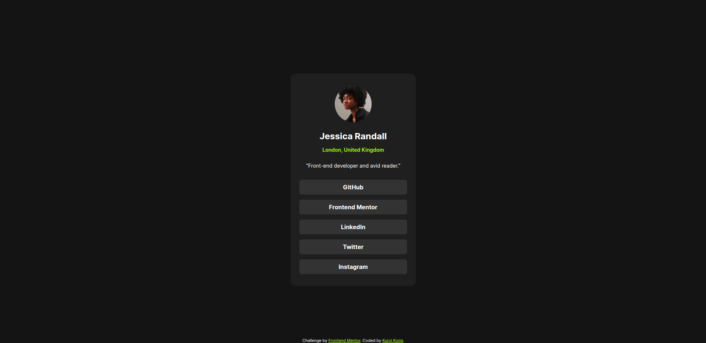

## Table of contents

- [Overview](#overview)
  - [Screenshot](#screenshot)
  - [Links](#links)
- [My process](#my-process)
  - [Built with](#built-with)
  - [What I learned](#what-i-learned)
- [Author](#author)

## Overview
This is a html css for the third challenge in frontend Mentor

### Screenshot

### Links

- Live Site URL: [site url](https://social-links-rama.netlify.app/)

## My process

### Built with

- Semantic HTML5 markup
- CSS custom properties
- Flexbox

### What I learned

I learned how to use css flexbox, how to add hover effects , how to style text and how to put elements together.

## Author

  I'm RAMAROJAONA Ravaka an actual CS student , I would like to be better in frontend development.

- LinkedIn - [Ravaka Ramarojaona](https://www.linkedin.com/in/ravaka-ramarojaona-145355249/)
- Frontend Mentor - [@Sarobidy](https://www.frontendmentor.io/profile/ravaka5)

